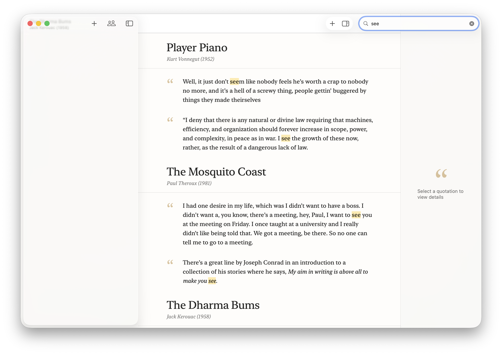
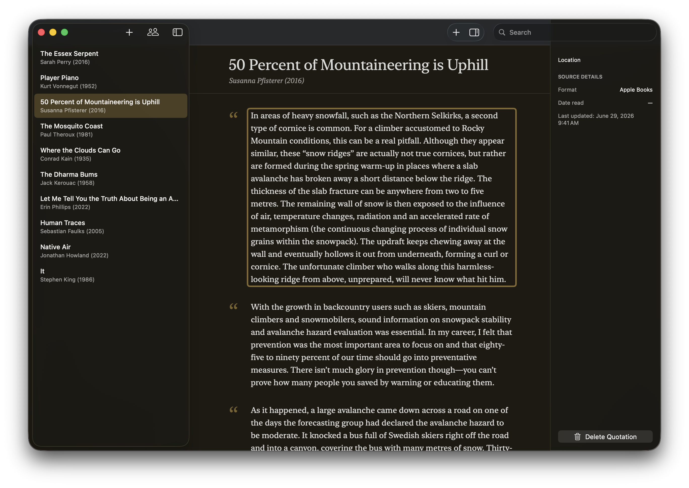

# Quotations

Quotations is a native macOS app for collecting and revisiting passages from books and other sources, designed to be as minimalistic as possible. Organize entries by author and source, search across your library, and edit quotations inline with rich text formatting. Page locations and metadata live in a sidebar inspector. Built with SwiftUI and SwiftData.





I also made a terminal alias to automate app builds outside of Xcode (update `path/to/repo` accordingly):

```bash
alias qab="cd path/to/repo && \
  xcodebuild -scheme Quotations -configuration Release -destination 'platform=macOS' \
    -derivedDataPath build clean build && \
  rm -rf /Applications/Quotations.app && \
  cp -R build/Build/Products/Release/Quotations.app /Applications/ && \
  open /Applications/Quotations.app"
```
