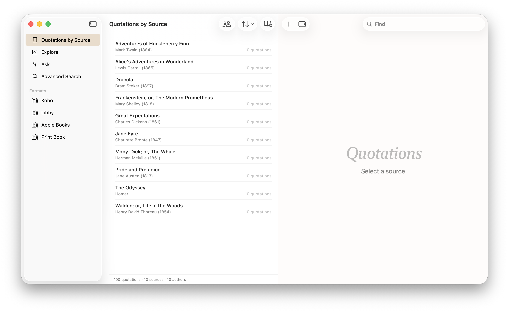
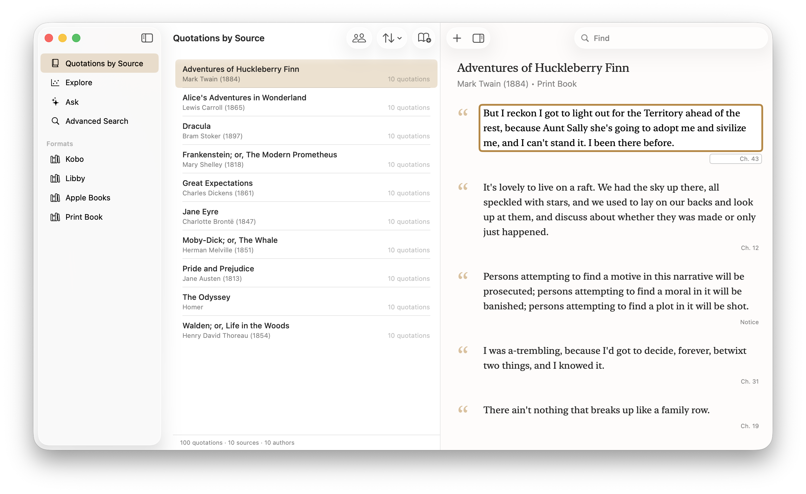
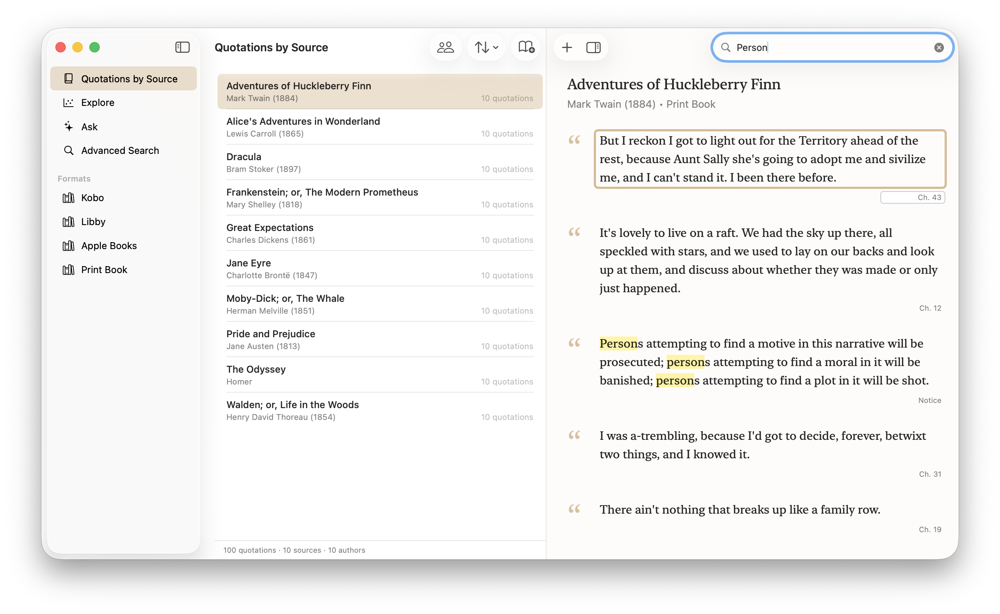
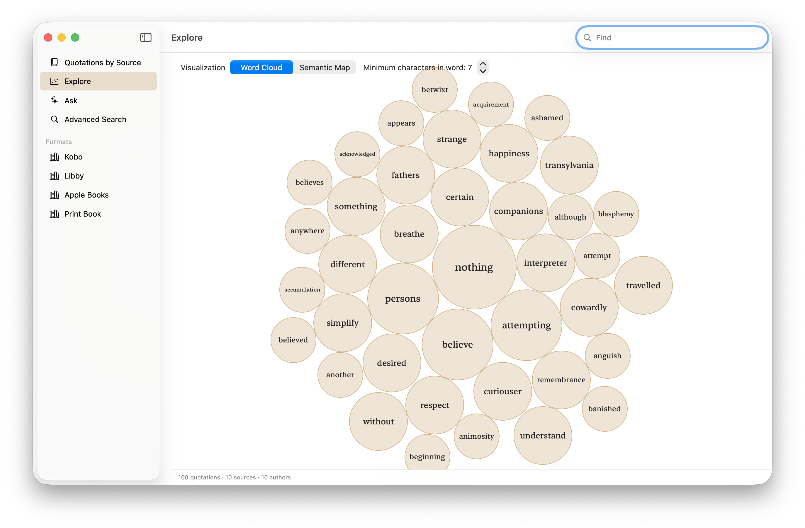
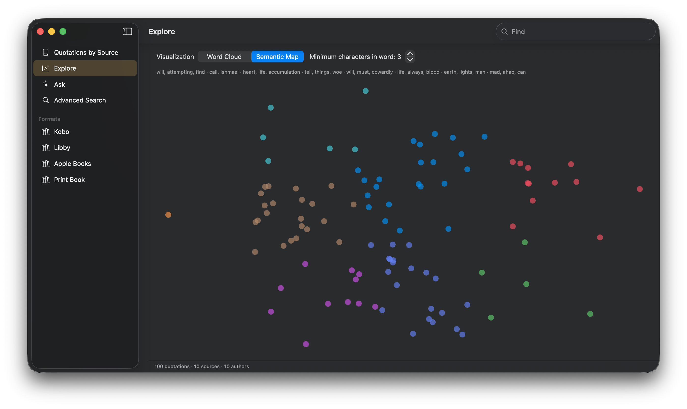
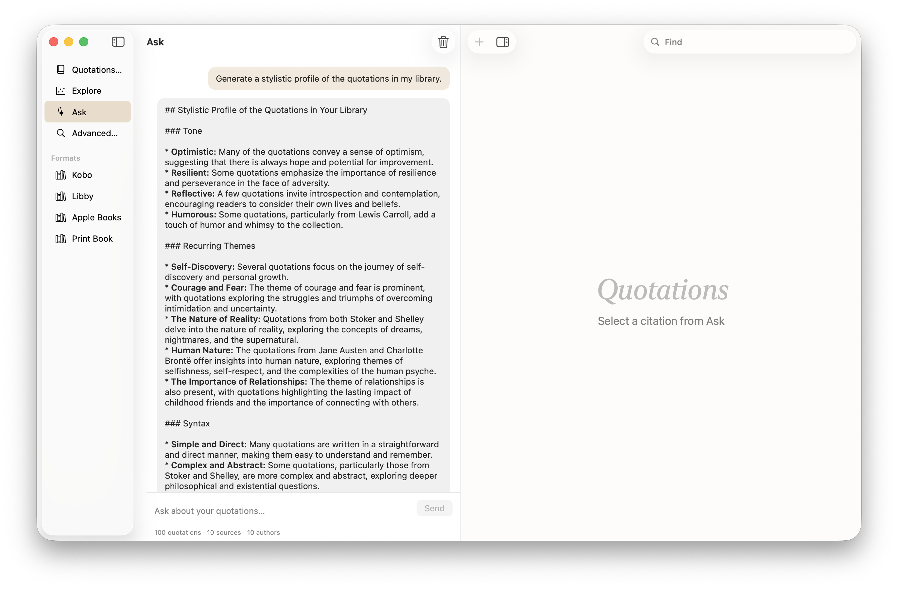

# Quotations

Quotations is a native macOS app for collecting and revisiting passages from books, designed to be as minimalistic as possible. Organize entries by author and source, search across your library, and edit quotations inline with rich text formatting. Built with SwiftUI, AppKit and SwiftData. This app is open source; free free to fork it.

## Library

Browse sources, filter by format (Kobo, Libby, Apple Books, or Print Book). Select a source to view its quotations.



## Editing

Open a source to view its quotations. Add new quotations or edit existing ones inline.



## Find in Page

Search within the current source. Matching text is highlighted in place.



## Word Cloud

Explore frequent words across your library as a zoomable bubble chart. Adjust the minimum word length to focus on longer, more distinctive terms.



## Semantic Map

Switch to Semantic Map to plot quotations by meaning. Related passages cluster together, with theme labels derived from shared vocabulary.



## Ask

Ask questions about your library in natural language (runs on device if you have macOS 25+). The assistant will retrieve relevant quotations and summarize the findings (Retrieval Augmented Generation). Note that results may not be perfect.



## Additional Features

A list of some other features:

- CSV import
- Apple Books import
- Library backups
- Semantic search (search by meaning, not just string matching)
- Demo mode (a pre-populated list of quotations)

## Building via CLI

I also made a terminal alias to automate app builds outside of Xcode (update `path/to/repo` accordingly). Note that you’ll need to set your development team within Xcode first.

```bash
alias qab="cd path/to/repo && \
  xcodebuild -scheme Quotations -configuration Release -destination 'platform=macOS' \
    -derivedDataPath build -allowProvisioningUpdates clean build && \
  rm -rf /Applications/Quotations.app && \
  cp -R build/Build/Products/Release/Quotations.app /Applications/ && \
  open /Applications/Quotations.app"
```
